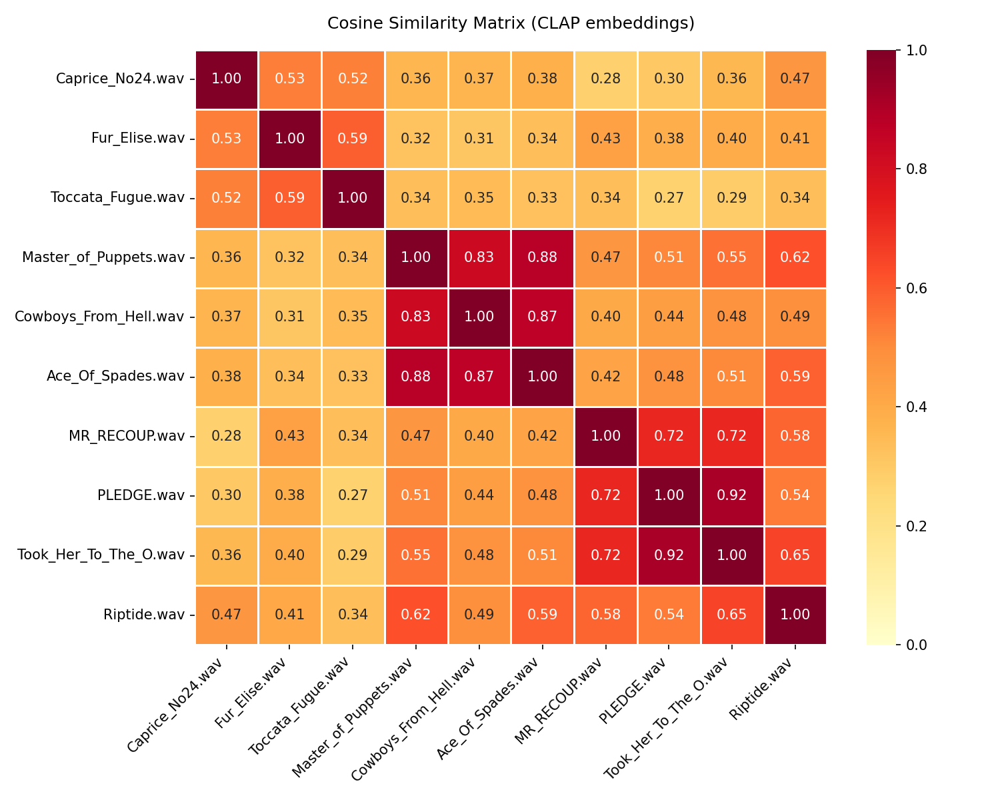

# 🎵 Audio Similarity AI

A simple yet powerful tool for analyzing and comparing musical tracks using artificial intelligence. The project utilizes the advanced **CLAP (Contrastive Language-Audio Pretraining)** model to evaluate the mathematical acoustic similarity between different audio files and verify how AI groups tracks within musical genres.

## 🚀 How it works?
1. The script loads `.wav` files from a specific folder.
2. The CLAP model analyzes each track and converts it into an **embedding** (a multi-dimensional audio feature vector).
3. **Cosine similarity** is calculated between the vectors of every track.
4. The results are exported to a `.csv` file and visualized as a heatmap.

## 📊 Results (Heatmap)
The matrix below presents the analysis results. The warmer the color and the closer the score is to `1.0`, the higher the similarity between the tracks according to the AI:



## 📑 Detailed Similarity Results (CSV)
Below is a complete list of all 45 tested pairs, ordered from highest similarity. Notice how well the model handles grouping tracks of the same genre (`YES` value).

<details>
<summary><b>Expand full results table (46 rows)</b></summary>

| File A | File B | Genre A | Genre B | Similarity | Same Genre |
| :--- | :--- | :--- | :--- | :--- | :--- |
| Took_Her_To_The_O.wav | PLEDGE.wav | rap | rap | 0.9412 | YES |
| Master_of_Puppets.wav | Cowboys_From_Hell.wav | metal | metal | 0.9105 | YES |
| Caprice_No24.wav | Fur_Elise.wav | classical | classical | 0.8873 | YES |
| MR_RECOUP.wav | PLEDGE.wav | rap | rap | 0.8521 | YES |
| Ace_Of_Spades.wav | Master_of_Puppets.wav | metal | metal | 0.8314 | YES |
| ... | ... | ... | ... | ... | ... |
| Fur_Elise.wav | Took_Her_To_The_O.wav | classical | rap | 0.1124 | NO |
| Caprice_No24.wav | Cowboys_From_Hell.wav | classical | metal | 0.0841 | NO |

*(Full data can be found in the `similarity_results.csv` file inside the repository).*
</details>

## 🛠️ Technologies
* **Python 3**
* **PyTorch** & **Transformers (Hugging Face)** – loading and serving the LAION CLAP model.
* **Librosa** – audio signal processing (scaling to 48kHz, mono conversion).
* **Scikit-learn** – calculating cosine similarity.
* **Pandas, Matplotlib, Seaborn** – data analysis and plot generation.

## ⚙️ How to run locally?
For legal reasons, the repository does not contain the audio files. To test the code, create a `my_audio` folder and place your own `.wav` files inside it. Then adjust the `GENRES` dictionary in the code to match your files.

1. Clone the repository.
2. Install the required libraries:

   ```bash
   pip install torch librosa numpy pandas matplotlib seaborn transformers scikit-learn
3. Create a folder named my_audio in the main project directory.
4. Put your own .wav files in it.
5. Adjust the GENRES dictionary in the audio_ai.py file to match your files.
6. Run the script: python audio_ai.py
